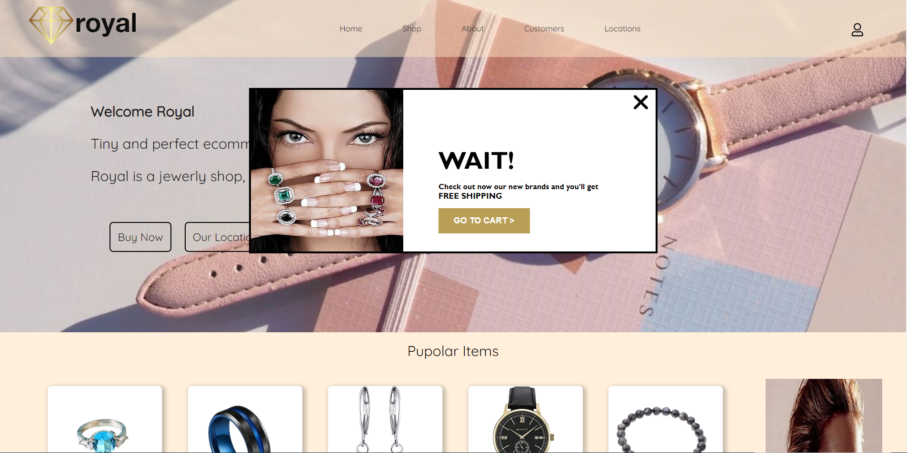
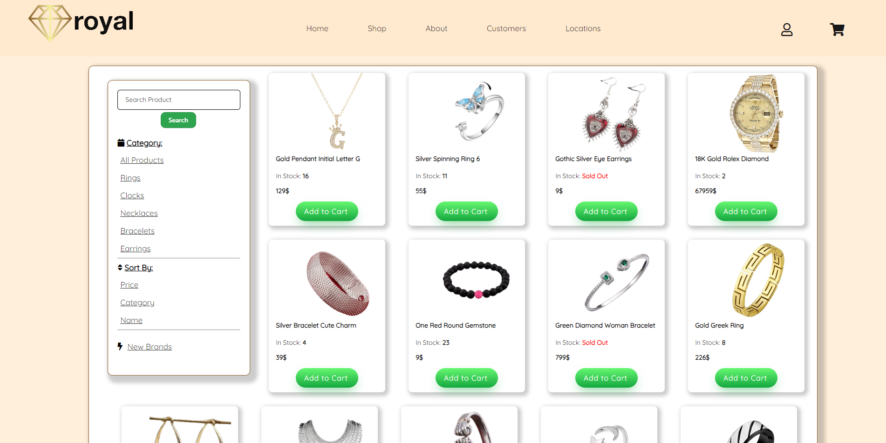
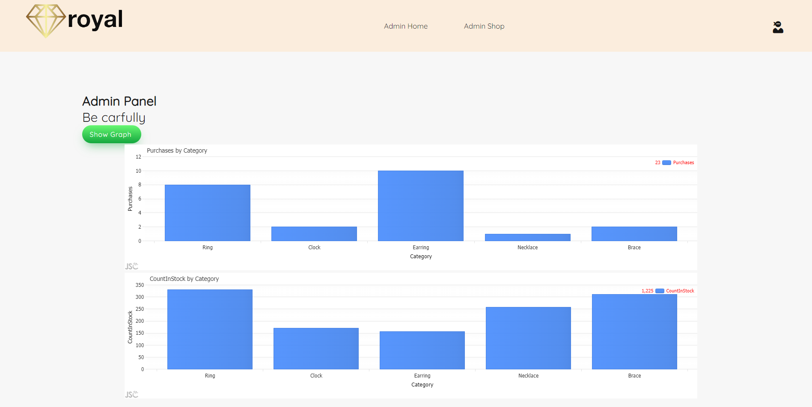

###### Link to website - https://royal-project.onrender.com/
# Royal Jewelry - Online Jewelry Store

### Project Description:
Royal Jewelry is an online jewelry store website offering a wide range of luxurious and beautifully designed jewelry pieces. The website allows users to browse through the variety of products, add items to their shopping cart, and make purchases easily and conveniently.

## Installation and Setup:
### To run the project locally, follow these steps:

- Clone the repository to your local machine.
- Navigate to the project directory in your terminal.
- Install the necessary dependencies by running npm install.
- Ensure MongoDB is installed and running on your machine.
- Start the server by running **npm start**.
- Access the website in your web browser at http://localhost:3300.

## Features:
- Product Catalog: Browse through a wide range of jewelry products.
- Shopping Cart: Add items to the shopping cart for purchase.
- Admin panel enables viewing purchase quantities, managing orders, and adding or removing products seamlessly.

## Components:
1. **Frontend:**
User Interface (UI): The frontend interface where users interact with the website, browse products, add items to the cart, and complete purchases.
Design and Layout: Design elements, including colors, fonts, and layout, ensuring an attractive and intuitive user experience.
Responsive Design: Ensuring the website is accessible and user-friendly across various devices and screen sizes.
2. **Backend:**
Server-Side Logic: Backend logic responsible for handling user requests, processing data, and generating responses.
API Endpoints: Define endpoints for communication between the frontend and backend, enabling data exchange and functionality implementation.
Data Management: Store and manage product information, user data, and order details using a database management system.
3. **Admin Panel:**
Admin Dashboard: A centralized dashboard providing administrators with access to manage products, orders, users, and website content.
Sales and Inventory Management: Tools for monitoring sales performance, tracking inventory levels, and analyzing business metrics.
User Management: Features for managing user accounts, permissions, and authentication settings.
4. **Database:**
Data Storage: Store and retrieve data related to products, orders, users, and other website content.
Database Management System (DBMS): Choose an appropriate DBMS such as MongoDB, MySQL, or PostgreSQL for efficient data storage and retrieval.

---

---